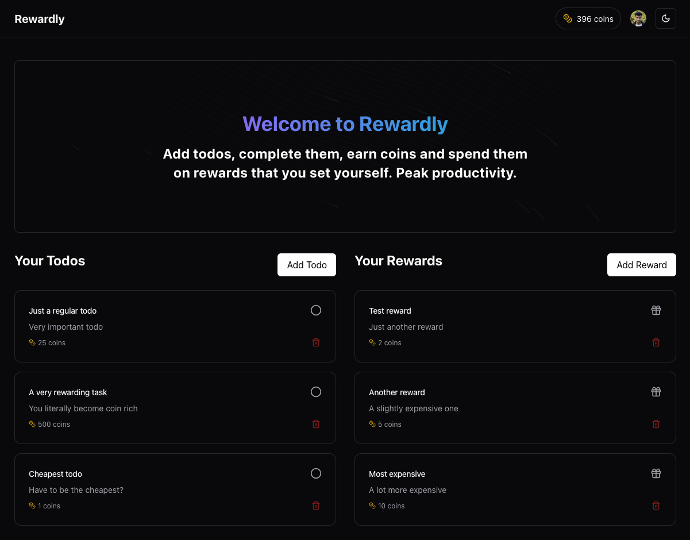

# Rewardly

Rewardly is an open-source Habitica clone (with a lot less features) mainly focused for a YouTube tutorial. With Rewardly, you can create todos and complete them to receive coins which you can spend on your personal marketplace which you create.

It is a great way to keep yourself accountable. Just don't misuse the coin system and you're using it in it's full potential.

> NOTE: The YouTube video with tutorial to build this app is still in planning stage and will be out pretty soon and I will update the link here.

## How to use

Here's how you can run this app locally:

- Clone this repository.
- In this app, we are using Bun as our runtime and package manager. Feel free to use any other runtime / package manager. Run the following command in the project root to install dependencies:

```bash
bun install
```

- Rename `.env.example` to `.env` (not `.env.local`) and add appropriate values to the variables. This app uses Turso SQLite as a database and external services like Clerk for authentication and Stripe for payments. Make sure you add the variable values accordingly. _Clerk webhook is optional (for now), but is recommended to use_.
- To setup Clerk webhook, create a tunnel using `ngrok` (tutorial later) to create an HTTP URL that leads to your local development server. Use this URL in Clerk dashboard webhook page like `<ngrok link>/api/webhook`. Update your environment variable with signing secret provided by Clerk.
- To run the app in development mode, run the following command:

```bash
bun dev
```

## Conclusion & Contributing

As of now, I have no plans of maintaining this project beyond my tutorial about this. If this app gains traction, I might let contributors contribute to this project meaningfully. As of now, I would accept improvements in a separate branches only. **Please create an issue before contributing to this repository**.
